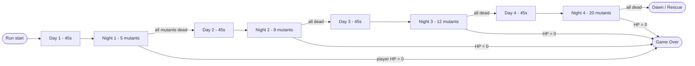
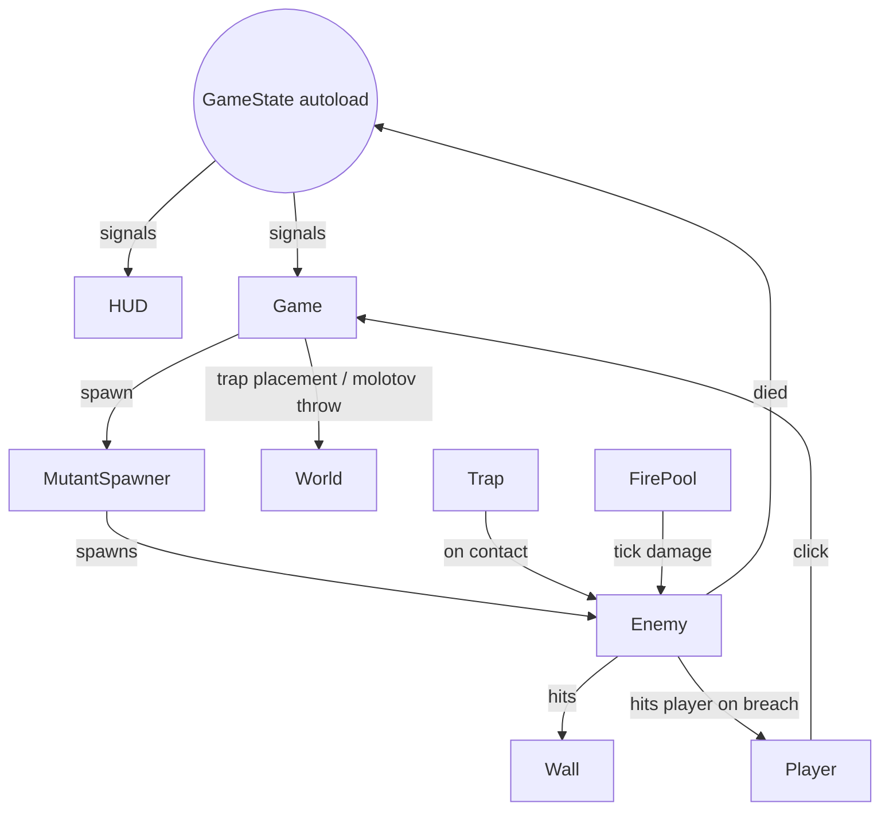

# Day/night siege loop — design plan

> Implement the day/night/wave loop with sortie-and-craft day phases, strict kill-quota nights, molotov throwables, and traps as the only mutant-killers. Includes the missing prerequisites: enemy behavior (`enemy.gd` is currently missing), player HP, a `GameState` autoload, HUD, and win/lose screens.

## Scope

Implement the three picked features end-to-end:

- **#2 Throwables (molotov only).** Crafted at workbench during day, thrown over walls during night, drops a fire pool that damages mutants.
- **#10 Day/night cycle.** ~45s day (door open, scavenge + craft) → night (door sealed, mutants attack until all dead).
- **#14 Wave counter.** Strict kill-quota: night ends only when all mutants in the wave are dead. 4 nights total.

Plus prerequisites the picks require to be playable: mutant behavior, player HP, traps (bear + electric), HUD, win/lose screens, `GameState` autoload.

Not in scope (explicitly): spike walls, stab-through-walls, mutant variety (only one type), rock/smoke throwables, lure mechanic, defendable interior object.

## Phase / state flow

## Architecture overview

Add one autoload, `GameState`, that owns: phase, day count, wave count, mutants_alive, scrap, molotovs_held, player_hp. It emits typed signals (`phase_changed`, `wave_started`, `mutant_count_changed`, `scrap_changed`, `molotov_count_changed`, `hp_changed`, `run_won`, `run_lost`). HUD and spawners listen; nothing reaches deep into the scene tree.

Game flow controller stays in `core/game.gd`, but it delegates phase progression to `GameState` and just reacts to its signals (instantiate spawner, fade tints, etc.).

## Files to add

### Core / state
- `core/game_state.gd` — new autoload. Holds run-wide state and signals.
- `core/wave_data.gd` — small `Resource` defining `mutant_count` and `spawn_interval_seconds` per night. Hardcode 4 entries for v1.

### Enemy
- `entities/enemies/enemy.gd` — currently missing! State machine: `SEEK_WALL -> ATTACK_WALL -> (on wall destroyed) SEEK_PLAYER -> ATTACK_PLAYER -> DEAD`. HP, `take_damage(amount)`, `died` signal that decrements `GameState.mutants_alive`. Uses existing `walk` and `attack` animations.
- `entities/enemies/mutant_spawner.gd` + `.tscn` — active only at night. Spawns mutants from off-screen `Marker2D`s at the wave's interval until the wave's count is met.

### Throwables
- `entities/throwables/molotov.gd` + `.tscn` — `Node2D` projectile. Tween for fake parabolic arc (`position` + `scale` over ~0.6s), spawns a `FirePool` at landing point. No physics; cosmetic-only flight.
- `entities/throwables/fire_pool.gd` + `.tscn` — `Area2D` with `Timer`, lifetime ~5s, ticks damage on overlapping enemies every 0.4s.

### Traps
- `entities/traps/trap.gd` — base: `armed` flag, `placed_by_player` marker, signals.
- `entities/traps/bear_trap.gd` + `.tscn` — one-shot. On first enemy overlap: heavy damage + brief root via setting enemy `velocity = 0` for ~1s, then sprite swaps to "sprung" and `armed = false`. Can be re-armed during day for free (right-click on it as the player).
- `entities/traps/electric_trap.gd` + `.tscn` — reusable AoE. `charges` (default 3) per night; while charged, ticks damage in radius every 1s; alternates on/off sprite. Charges replenish to max at start of each night.
- Trap placement is *inside* the wall ring only — validated against shelter polygon.

### Day-phase props
- `entities/props/door.gd` + `.tscn` — placed where `puertayescalera` currently sits in `levels/level_01.tscn`. Toggles its `CollisionShape2D.disabled` based on `GameState.phase`.
- `entities/props/scrap_pile.gd` + `.tscn` — `Area2D` pickup. Walking over it adds 1 scrap and `queue_free`s.
- `entities/props/workbench.gd` + `.tscn` — `Area2D`. While player overlaps and phase is DAY, HUD shows a "Craft Molotov (2 scrap)" prompt; clicking it spends scrap and increments `molotovs_held`.

### UI
- `UI/hud.tscn` + `.gd` — `CanvasLayer`. Children:
  - Day/Night phase label + day countdown timer
  - Wave label "Night X / 4 — N left" (visible only at night)
  - Scrap counter (icon: `RECURSOS naranja.png`)
  - Molotov counter
  - Trap slot bar (uses `marco trampas.png`) — clickable buttons that enter placement mode for that trap type
  - Player HP bar
  - Workbench prompt (shown while player is in workbench area during day)
- `UI/game_over.tscn` + `.gd` — uses `sprites/UI/GAME OVER 02.png`. Fades in on `run_lost`. "Retry" button reloads the level.
- `UI/win_screen.tscn` + `.gd` — "You survived. Dawn breaks." Fades in on `run_won`.

## Files to modify

- `entities/player/player.gd` — add `max_hp`, `hp`, damage cooldown, death (play `Dead` sprite, emit `run_lost`). Extend `_input`: route click through a `ClickRouter` (in HUD or `Game`) so click can mean: place trap (placement mode), throw molotov (throw mode), or move (default).
- `entities/walls/wall.gd` — already has `wall_destroyed` signal; mutants connect to it to switch from `ATTACK_WALL` to `SEEK_PLAYER`.
- `core/game.gd` — wire `GameState` signals: instantiate HUD on level load; on `phase_changed` fade tint and play bell SFX; on `wave_started` instantiate `MutantSpawner` with that wave's data; on `run_won` / `run_lost` show appropriate screen. Add a `tint_overlay` `ColorRect` for day-vs-night look.
- `levels/level_01.tscn` — add `Door` (replace `puertayescalera` decoration position), `Workbench`, `OutsideZone` (Marker2D + region for scrap pile spawns), 4 enemy spawn `Marker2D`s off-screen, expand `WorldBounds/SouthWall` so the area south of the door is walkable.
- `project.godot` —
  - Autoload `GameState`
  - Physics layers: layer_3 = `enemy`, layer_4 = `trap`, layer_5 = `projectile`
  - Input actions: `cancel` (RMB / Esc); `interact` already exists — reuse for workbench
- `core/audio_manager.gd` — add `play_music_track(stream, fade_seconds)` for day/night music swap (or just keep one track for v1).

## Key constants (one place to tune)

In `GameState` (or a `wave_data.gd` resource):

- Day duration: 45 s
- Starting scrap: 2; molotov craft cost: 2; molotov inventory cap: 3
- Player max HP: 100; mutant contact damage: 10; damage cooldown: 0.6 s
- Mutant HP: 30; attack damage to wall: 8; attack interval: 0.8 s
- Bear trap: damage 40, root 1.0 s, free re-arm during day
- Electric trap: 8 dmg / 1 s tick, radius 32 px, 3 charges per night
- Trap placement cap: 4 simultaneous; bear trap cost 1 scrap, electric trap cost 3 scrap
- Wave counts: `[5, 8, 12, 20]`; spawn intervals: `[2.5, 2.0, 1.7, 1.3]` seconds
- Scrap piles per day: `[3, 4, 4, 5]`
- Fire pool: lifetime 5 s, 6 dmg / 0.4 s tick, radius 24 px

## Implementation order

| # | Task |
|---|------|
| 1 | Add `GameState` autoload (`core/game_state.gd`) with phase/wave/scrap/molotov/HP fields and typed signals; register in `project.godot`. |
| 2 | Add physics layers (enemy=3, trap=4, projectile=5) and `cancel` input action in `project.godot`. |
| 3 | Implement `entities/enemies/enemy.gd` state machine, HP + `take_damage`, `died` signal, contact damage to player. |
| 4 | Add HP, damage-cooldown, and death to `entities/player/player.gd`; emit `GameState.run_lost` on death; play `Dead` sprite. |
| 5 | Add `entities/enemies/mutant_spawner.gd` + `.tscn` that reads current wave count/interval from `GameState` and spawns from off-screen markers. |
| 6 | Build `UI/hud.tscn` with HP bar, scrap, molotov, wave counter, day/night label, trap slot bar, workbench prompt; bind to `GameState` signals. |
| 7 | Add day/night phase manager in `GameState`; wire bell SFX + tint overlay fade in `core/game.gd`; win after night 4. |
| 8 | Add `entities/props/door.gd` + `.tscn` and expand `WorldBounds/SouthWall` so player can step outside during day; door collision toggles on phase change. |
| 9 | Add `entities/props/scrap_pile.gd` + spawning at day start; add `entities/props/workbench.gd` with craft-molotov interaction (2 scrap → +1 molotov, cap 3). |
| 10 | Add `entities/throwables/molotov.gd` (tweened arc) and `entities/throwables/fire_pool.gd` (5 s AoE damage). Add throw-mode click routing. |
| 11 | Add `entities/traps/trap.gd` base, `bear_trap.gd` (one-shot, re-armable in day), `electric_trap.gd` (3 charges/night, AoE). |
| 12 | Trap-slot HUD buttons enter placement mode (ghost preview follows cursor), validate inside-shelter polygon, place on click and deduct scrap; right-click cancels. |
| 13 | Add `UI/game_over.tscn` and `UI/win_screen.tscn`; `core/game.gd` shows them on `GameState.run_lost` / `run_won`. |
| 14 | Playtest run; tune the constants block (HP, damage, scrap economy, wave counts) so all 4 nights are completable but tense. |

The order is chosen so each step is independently testable in-editor. After step 3 you can fight one mutant; after step 6 you can survive a full wave; after step 8 you have day/night; after step 10 you can throw molotovs; after step 12 you can place traps; after step 13 you have win/lose screens.

## Risks / open notes

- **Click-routing collision.** The current `player.gd` consumes `click` for movement. We must add a router so HUD trap-slot buttons and "throw mode" intercept the click before it reaches the player. Plan: add a `ClickRouter` autoload (or method on HUD) that returns the current click intent; player only moves when intent is `MOVE`.
- **Outside zone scope.** Truly free-roam outside is out of scope. The "outside" is just a small strip south of the door; mutants spawn from off-screen further south at night. Day's outside is bounded by `WorldBounds` already.
- **Re-arming bear traps.** Right-click on a sprung bear trap during day re-arms it for free. If this feels overpowered we'll add a small scrap cost in tuning.
- **Trap placement validity.** "Inside the shelter" is checked by point-in-polygon against the wall ring corners; we'll bake this polygon as a constant on the level or compute from corner positions at level load.
- **Animation gaps.** Player has `repair` and `dead` sprites but no `throw` animation. We'll reuse `repair` (arm motion) for the throw, with the molotov visually leaving the player position. Acceptable for jam scope.
